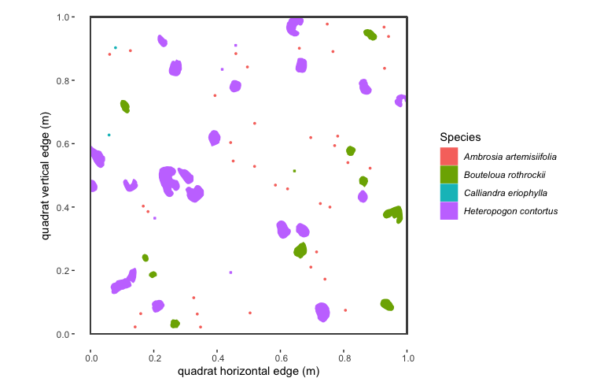
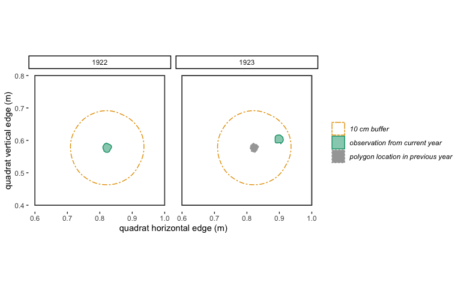
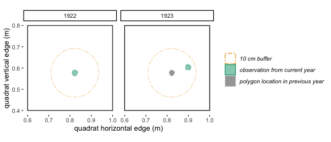
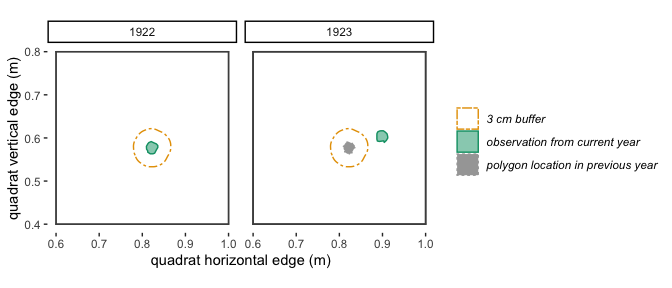
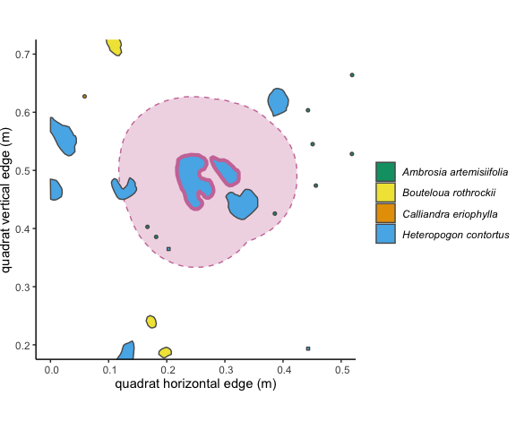

<!-- README.md is generated from README.Rmd. Please edit that file -->

# `plantTracker` <a href="http://www.astearsresearch.com/package/planttracker/"></a>

<!-- badges: start -->

[](https://CRAN.R-project.org/package=plantTracker)
[](https://github.com/aestears/plantTracker/actions/workflows/check-standard.yaml)
[](https://github.com/aestears/plantTracker/actions/workflows/test-coverage.yaml)

[](https://opensource.org/license/mit/)
[](https://zenodo.org/badge/latestdoi/353094728)
<!-- badges: end -->

Welcome to `plantTracker`! This package was designed to transform
**long-term quadrat maps** that show plant occurrence and size into
**demographic data** that can be used to answer questions about
population and community ecology.

## Table of Contents

- [Installing `plantTracker`](#Installation)  
- [Contributing](#issues)
- [License](#license)
- [Contact](#contact)
- [How to Use `plantTracker`](#how_to_use)
  - [Prepare data for use in `plantTracker`](#prep_data)
    - [The quadrat map data: `dat`](#dat_data)
      - [transform `dat` to the `sf` format](#dat_to_sf)
    - [The quadrat inventory data: `inv`](#dat_inv)
  - [Ensure data is in the correct format with `checkDat()`](#check_dat)
  - [Track individuals through time using `trackSpp()`](#trackSpp)
    - [Arguments in `trackSpp()`](#trackSpp_args)
    - [Understanding the output of `trackSpp()`](#trackSpp_out)
  - [Calculate local neighborhood density using
    `getNeighbors()`](#getNeigh)
    - [Arguments in `getNeighbors()`](#getNeigh_args)
    - [Understanding the output of `trackSpp()`](#getNeigh_out)
  - [Further analysis with more `plantTracker` functions](#next)

<a id="Installation"></a>

## Installation

Install `plantTracker` from
[CRAN](https://CRAN.R-project.org/package=plantTracker):

``` r
install.packages("plantTracker")
```

Alternatively, you can install the current version of `plantTracker`
from [GitHub](https://github.com/):

``` r
install.packages("devtools")
devtools::install_github("aestears/plantTracker")
```

<a id="issues"></a>

## Contributing

Please report any problems that you encounter while using `plantTracker`
as “issues” on (our GitHub
repository)\[<https://github.com/aestears/plantTracker/issues/>\]. Help
us make this package better!

<a id="license"></a>

## License

This package is licensed under MIT License Copyright (c) 2022 Alice
Stears

<a id="contact"></a>

## Contact

Questions about `plantTracker` can be forwarded to Alice Stears, the
package maintainer, at <alice.e.stears@gmail.com>.

<a id="how_to_use"></a>

## How to use the `plantTracker` R package

The material below explains how to use `plantTracker`, starting with
formatting your data correctly. This information is also available in
the ‘Suggested `plantTracker` Workflow’ vignette, which is included in
the package.

<a id="prep_data"></a>

### *1.* Prepare data

The functions in `plantTracker` require data in a specific format.
`plantTracker` includes an example dataset that consists of two pieces:
`grasslandData` and `grasslandInventory`. You can load these example
datasets into your global environment by calling `data(grasslandData)`
and `data(grasslandInventory)`. You can view the documentation for these
datasets by calling`?grasslandData` and `?grasslandInventory`.

Most `plantTracker` functions require two data objects. The first is a
data frame that contains the location and metadata for each mapped
individual, which we from now on will call `dat`. The second is a list
that contains a vector of years in which each quadrat was sampled, which
we from now on will cal `inv`.

Below are the basic requirements for these data objects.

<a id="dat_data"></a>

#### *1.1* The `dat` data frame must . . .

- … be an `sf` data.frame. More on this below in section
  [*1.1.1*](#dat_to_sf)…
- … contain a row for each individual observation in each year.
- … have a column that contains character strings indicating the
  specific epithet for each observation. This column must be a character
  data type. The function expects this column to be called “Species”,
  but a different name can be specified in function calls.
- … have a column that contains character strings indicating the site at
  which each observation was collected. This is a level of
  classification “above” the quadrat (i.e. all quadrats measured at the
  Central Plains Experimental Range in Nunn, CO might have the value
  “CO” in this column). This column must be a character data type. The
  function expects this column to be called “Site”, but a different name
  can be specified in function calls.
- … have a column that contains character strings indicating the quadrat
  at which each observation was collected. This column must be a
  character data type. The function expects this column to be called
  “Quad”, but a different name can be specified in function calls.
- … have a column that contains a value indicating the year when this
  individual observation was collected. This must be a numeric data
  type, and must be either a four or two digit year number. The function
  expects this column to be called “Year”, but a different name can be
  specified in function calls.
- … have a column (almost always called “geometry” in the `sf` package
  data format) that contains a polygon representing the location of each
  observation. Each observation must be a `POLYGON` or `MULTIPOLYGON`.
  Data cannot be stored as `POINTS`.
- If the data was collected such that forbs or small grasses were mapped
  as points and digitized as such, then these observations must be
  converted to polygons. We recommend that you convert them to small
  circular polygons with an identical radius. If you do this
  transformation, we also recommend that you include a column that
  indicates whether each row was originally mapped as a polygon or a
  point, since the demographic data that deals with size will be
  relatively meaningless for observations originally mapped as points.
- `dat` does not need to have a coordinate reference system (i.e. CRS
  can be “NA”), but it can have one if you’d like.
- … *not* have columns called “neighbors”, “nearEdge”, “trackID”, “age”,
  “size_tplus1”, “recruit”, “survives_tplus1”, “basalArea_ramet”, or
  “basalArea_genet”, since these columns are added by `plantTracker`
  functions.
- Note: Additional columns can be included in the input data.frame,
  although they might not be included in the output of `plantTracker`
  functions.

Here are the first few rows of a possible `dat` input data.frame:

    #> Simple feature collection with 6 features and 6 fields
    #> Geometry type: POLYGON
    #> Dimension:     XY
    #> Bounding box:  xmin: -0.000160084 ymin: 0.4334812 xmax: 0.286985 ymax: 0.9419673
    #> CRS:           NA
    #>                 Species Type Site Quad Year sp_code_6
    #> 1 Heteropogon contortus poly   AZ  SG2 1922    HETCON
    #> 2 Heteropogon contortus poly   AZ  SG2 1922    HETCON
    #> 3 Heteropogon contortus poly   AZ  SG2 1922    HETCON
    #> 4 Heteropogon contortus poly   AZ  SG2 1922    HETCON
    #> 5 Heteropogon contortus poly   AZ  SG2 1922    HETCON
    #> 6 Heteropogon contortus poly   AZ  SG2 1922    HETCON
    #>                         geometry
    #> 1 POLYGON ((0.237747 0.908835...
    #> 2 POLYGON ((0.2833037 0.85959...
    #> 3 POLYGON ((0.008583123 0.449...
    #> 4 POLYGON ((0.1480142 0.46983...
    #> 5 POLYGON ((0.03573306 0.5259...
    #> 6 POLYGON ((0.2441894 0.52689...

- Note: that the required columns are “Species”, “Site”, “Quad”, “Year”,
  and “geometry”. The additional columns “Type” and “sp_code_6” are just
  “along for the ride” in any analysis using `plantTracker` functions.

Here’s what some of the example `dat` data (from the “SG2” quadrat at
the “AZ” site in 1922) look like when plotted spatially:

    #> Warning: Using `size` aesthetic for lines was deprecated in ggplot2 3.4.0.
    #> ℹ Please use `linewidth` instead.
    #> This warning is displayed once every 8 hours.
    #> Call `lifecycle::last_lifecycle_warnings()` to see where this warning was
    #> generated.

<div class="figure" style="text-align: center">


<p class="caption">
Figure 1.1 : Spatial map of a subset of example ‘dat’ dataset
</p>

</div>

It’s important to note that, while `plantTracker` was designed to be
used with small-scale maps of plant occurrence in quadrats, it is
conceivably possible to use other styles of map data in `plantTracker`
functions. All that is required is a single mapped basal area (or point
location converted to a small polygon) at each time point for each
organism (or ramet), and is accompanied by the required metadata
detailed above. For example, `plantTracker` functions could be used to
estimate tree demographic rates at the scale of 100 m x 50 m plots.

<a id="dat_to_sf"></a>

##### *1.1.1* Get your data into the `sf` data format

As mentioned above, `plantTracker` uses the `sf` R package to deal with
spatial data. The map data that `plantTracker` was built to analyze is
inherently spatial, so you need to know how to the basics of dealing
with spatial data in R if you want to use `plantTracker`! There are many
good resources to help you orient yourself to working with spatial data
in R generally:

- <https://cengel.github.io/R-spatial/intro.html>  
- <https://www.r-bloggers.com/2021/06/using-geospatial-data-in-r/>

And the `sf` package more specifically:

- <https://CRAN.R-project.org/package=sf>  
- <https://r-spatial.github.io/sf/>

These resources provide a great orientation, and while I recommend
looking over them if you’re new to working with spatial data in R, I’ve
included a brief tutorial for uploading shapefiles into R as `sf` data
frames.

Most of the published chart-quadrat datasets have the map data stored as
shapefiles in complex file structures, which can be a bit confusing to
navigate. `plantTracker` requires all of your data (for all species,
plots and years) to be in one single data frame. *This example shows how
you might navigate through a complex file structure to to pull out
shapefiles and put them into one single `sf` data frame. for further
analysis with `plantTracker`.* For this example, I’ll use a subset of
the data from the Santa Rita Experimental Range in Arizona, which has
been published in [this data
paper](https://figshare.com/articles/dataset/Data_Paper_Data_Paper/3553581?file=5622201).
In this dataset, shapefiles for each quadrat are stored in their own
folder. Within that folder there are two shapefiles for each year: one
that contains map data for polygons, and one that contains data for
points. The following code reads in those shapefiles, transforms the
points to polygons of a fixed radius, and puts all the data into one
`sf` data frame. If you want to follow along, download the
“shapefiles.zip” file from the data paper, un-zip it, and name it
“AZ_shapefiles”. The dataset that is the result of this example is the
same as part of the “grasslandData” dataset included in `plantTracker`.

``` r
#  save a character vector of the file names in the file that contains the 
# shapefiles (in this case, called "CO_shapefiles"), each of which is a quadrat
# note: 'wdName' is a character string indicating the path of the directory 
# containing the 'AZ_shapefiles' folder
quadNames <- list.files(paste0(wdName,"AZ_shapefiles/"))
# trim the quadrats down to 2, for the sake of runtime in this example 
quadNames <- quadNames[quadNames %in% c("SG2", "SG4")]

# now we'll loop through the quadrat folders to download the data
for (i in 1:2){#length(quadNames)) {
  # get the names of the quadrat for this iteration of the loop
  quadNow <- quadNames[i]
  #  get a character vector of the unique quad/Year combinations of data in 
  # this folder that contain polygon data
  quadYears <- quadYears <-  unlist(strsplit(list.files(
    paste0(wdName, "AZ_shapefiles/",quadNow,"/"),
    pattern = ".shp$"), split = ".shp"))
  # loop through each of the years in this quadrat
  for (j in 1:length(quadYears)) {
    # save the name of this quadYear combo
    quadYearNow <- quadYears[j]
    # read in the shapefile for this quad/year combo as an sf data frame 
    # using the 'st_read()' function from the sf package 
    shapeNow <- sf::st_read(dsn = paste0(wdName,"AZ_shapefiles/",quadNow), 
                            #  the 'dsn' argument is the folder that 
                            # contains the shapefile files--in this case, 
                            # the folder for this quadrat
                            layer = quadYearNow) # the 'layer' argument has the 
    # name of the shapefile, without the filetype extension! This is because each 
    # shapefile consists of at least three separate files, each of which has a 
    # unique filetype extension. 
    # the shapefiles in this dataset do not have all of the metadata we 
    # need, and have some we don't need, so we'll remove what we don't need and 
    # add columns for 'site', 'quad', and 'year'
    shapeNow$Site <- "AZs"
    shapeNow$Quad <- quadNow
    # get the Year for the shapefile name--in this case it is the last for 
    # numbers of the name
    shapeNow$Year <- as.numeric(strsplit(quadYearNow, split = "_")[[1]][2]) + 1900
    # determine if the 'current' quad/year contains point data or polygon data
    if (grepl(quadYearNow, pattern = "C")) { # if quadYearNow has point data
      # remove the columns we don't need
      shapeNow <- shapeNow[,!(names(shapeNow)
                              %in% c("Clone", "Seedling", "Area", "Length", "X", "Y"))]
      # reformat the point into a a very small polygon 
      # (a circle w/ a radius of .003 m)
      shapeNow <- sf::st_buffer(x = shapeNow, dist = .003)
      # add a column indicating that this observation was originally 
      # mapped as a point
      shapeNow$type <- "point"
    } else { # if quadYearNow has polygon data
      # remove the columns we don't need
      shapeNow <- shapeNow[,!(names(shapeNow) %in% c("Seedling", "Canopy_cov", "X", "Y", "area"))]
      # add a column indicating that this observation was originally 
      # mapped as a polygon
      shapeNow$type <- "polygon"
    }
    # now we'll save this sf data frame 
    if (i == 1 & j == 1) { # if this is the first year in the first quadrat
      dat <- shapeNow
    } else { # if this isn't the first year in the first quadrat, simply rbind 
      # the shapeNow sf data frame onto the previous data 
      dat <- rbind(dat, shapeNow)
    }
  }
}

# Now, all of the spatial data are in one sf data frame!
# for the sake of this example, we'll remove data for some species and years in order to make the example run faster (and to make this 'dat' data.frame identical to the "grasslandData" dataset included in this R pakcage).
dat <- dat[dat$Species %in% c("Heteropogon contortus", "Bouteloua rothrockii", "Ambrosia artemisiifolia", "Calliandra eriophylla", "Bouteloua gracilis", "Hesperostipa comata", "Sphaeralcea coccinea", "Allium textile"),]
dat <- dat[  (dat$Quad %in% c("SG2", "SG4") & 
             dat$Year %in% c(1922:1927)),]
```

In some spatial datasets, observations that were measured as “points” in
the field are still stored as “points” in the shapefiles. `plantTracker`
requires all observations to be stored as “polygon” geometry in order to
streamline functions, so we need to translate “points” into small
polygons of a fixed area. In this case, we’ll transform them into
circles with a radius of 1 cm (.01, since this dataset measures area in
meters). ‘dat’ has a column called “type.” A value of “point” in this
column will tell us that, even though the geometry of the “point” data
is now in “polygon” format, the values for basal area and growth are not
indicative of the true size of the plant.

``` r
# We use the function "st_buffer()" to add a buffer of our chosen radius (.01) around each point observation, which will transform each observation into a circle of the "polygon" format with a radius of .01. 
dat_1 <- st_buffer(x = dat[st_is(x = dat, type = "POINT"),], dist = .01)
dat_2 <- dat[!st_is(x = dat, type = "POINT"),]
dat <- rbind(dat_1, dat_2)
```

If you don’t want to download the data and format it into an sf
data.frame, you can also use a subset of the “grasslandData” data object
stored in this R package. You will just need to subset it to include
only the data from the “AZ” site. Code to do this is below:

``` r
dat <- grasslandData[grasslandData$Site == "AZ",]
```

<a id="dat_inv"></a>

#### *1.2* The `inv` list must . . .

- … be a named list
- … have element names that are each a character string identical to the
  name of a quadrat in `dat`. There cannot be two elements with the same
  name, and there cannot be an element with more than one quadrat in its
  name. There must be an element for each quadrat with data in `dat`.
- … have list elements that are each a numeric vector of years in which
  each quadrat was sampled. If a quadrat was “skipped” in a year, then
  that year must be excluded from this vector. The format of the years
  must be the same as the format of years in `dat` (i.e. if year is a
  four-digit number in `dat`, then it must be a four-digit number in
  `inv`). Make sure this is the years the quadrat was actually sampled,
  not just the years that have data in the `dat` data frame! This
  argument allows the function to differentiate between years when the
  quadrat wasn’t sampled and years when there just weren’t any
  individuals of a species present in that quadrat. If a quadrat wasn’t
  sampled in a given year, don’t put an ‘NA’ in `inv` for that year!
  Instead, just skip that year.

Here is an example of an `inv` argument that corresponds to the example
`dat` argument above. The quadrats that have data in `dat` are “SG2” and
“SG4”, so there are elements in `inv` that correspond to each of these
quadrats.

    #> $SG2
    #> [1] 1922 1923 1924 1925 1926 1927
    #> 
    #> $SG4
    #> [1] 1922 1923 1924 1925 1926 1927

If you already have a quadrat inventory as a data frame, it isn’t
complicated to reformat it to work with `plantTracker` functions. For
example, if your quadrat inventory data frame looks like this… :

    #>   quad1 quad2 quad3
    #> 1  2000  2000  2000
    #> 2  2001  2001    NA
    #> 3    NA  2002  2002
    #> 4  2003  2003  2003
    #> 5  2004  2004  2004
    #> 6  2005  2005  2005
    #> 7  2006  2006  2006
    #> 8  2007  2007  2007

… then do the following to get it into a format ready for
`plantTracker`:

``` r
quadInv_DF <- data.frame("quad1" = c(2000, 2001, NA, 2003, 2004, 2005, 2006, 2007),
           "quad2" = c(2000:2007), 
           "quad3" = c(2000, NA, 2002, 2003, 2004, 2005, 2006, 2007))

# use the 'as.list()' function to transform your data frame into a named list
quadInv_list <- as.list(quadInv_DF)
# we still need to remove the 'NA' values, which we can do using the 
# 'lapply()' function
(quadInv_list <- lapply(X = quadInv_list, FUN = function(x) x[is.na(x) == FALSE]))
#> $quad1
#> [1] 2000 2001 2003 2004 2005 2006 2007
#> 
#> $quad2
#> [1] 2000 2001 2002 2003 2004 2005 2006 2007
#> 
#> $quad3
#> [1] 2000 2002 2003 2004 2005 2006 2007
```

<a id="check_dat"></a>

#### *1.3* Check the `inv` and `dat` arguments using `checkDat()`

The generic `checkDat()` function:

``` r
checkDat(dat, inv = NULL, species = "Species", site = "Site", quad = "Quad",
  year = "Year", geometry = "geometry", reformatDat = FALSE, ...)
```

This step is optional, but can be useful if you’re unsure whether your
`dat` and `inv` arguments are in the correct format. The `plantTracker`
function `checkDat()` takes `dat` and `inv` as arguments for the
arguments `dat` and`inv`, and will return informative error messages if
either argument is not in the correct format.

Additional optional arguments to `checkDat()` are `species`, `site`,
`quad`, `year`, `geometry`, and `reformatDat`.

- **`species/site/quad/year/geometry`** These arguments only need to be
  included if the columns in `dat` that contain the data for species,
  site, quadrat, year and geometry of each observation are *different*
  from the names “Species”, “Site”, “Quad”, “Year, and”geometry”. For
  example, if the column in your version of `dat` that contains the
  species identity of each observation is called “species_names”, then
  the argument `species = "species_names"` must be included in your call
  to `checkDat()`.

- **`reformatDat`** is a TRUE/FALSE argument that determines whether you
  want the `checkDat()` function to return a version of `dat` that is
  ready to go into the steps of this workflow. If `reformatDat` = TRUE
  then `checkDat()` will return a list that contains the reformatted
  version of `dat`, the reformatted version of `inv` and an additional
  element called “userColNames”, which contains the column names in the
  input version of `dat` that are different from the expected column
  names of “Species”, “Site”, “Quad”, “Year, and”geometry” (if there are
  any). If `reformatDat` = TRUE, then `checkDat()` will return a message
  indicating that your data is ready for the next step. The default
  value is FALSE.

------------------------------------------------------------------------

<a id="trackSpp"></a>

### *2* Track individuals through time using `trackSpp()`

Now it’s time to transform your raw dataset into demographic data! This
is accomplished using the `trackSpp()` function. This function follows
individual plants from year to year in the same quadrat to determine
survival, size in the next year, age, and some additional
potentially-useful demographic data. It does this by comparing quadrat
maps from sequential years. If there is overlap of individuals of the
same species in consecutive years, then the rows in `dat` that contain
data for those overlapping individuals are given the same “trackID”, or
unique identifier.

Here is the generic `trackSpp()` function:

``` r
trackSpp(dat, inv, dorm, buff, buffGenet, clonal, species = "Species",
  site = "Site", quad = "Quad", year = "Year", geometry = "geometry",
  aggByGenet = TRUE, printMessages = TRUE, flagSuspects = FALSE,
  shrink = 0.1, dormSize = 0.05, ...)
```

<a id="trackSpp_args"></a>

#### *2.1* Function arguments

`trackSpp()` takes the following arguments:

- **`dat`** This is the `sf` data frame that we’ve been calling `dat` so
  far. This must be in the correct format (which you can check
  before-hand using `checkDat()`), but informative error messages will
  be returned if it is incorrect. It *must* have the columns outlined in
  Section [1.1](#dat_to_sf), but they can have different names as long
  as those names are included in this function call (more on that
  later…).
- **`inv`** This is the list of quadrat sampling years we’ve been
  calling `inv`. If it is not in the correct format or does not contain
  data for the correct quadrats, then an informative error message will
  be returned.
- **`dorm`** This is a positive integer value that indicates how long
  you want the function to allow an individual to be “dormant”. In this
  case, dormancy can be interpreted as the biological phenomenon where a
  plant has above-ground tissue present in year 1, is alive underground
  but with no above-ground tissue in year 2, and then has above-ground
  tissue in a subsequent year. Dormancy can also be interpreted here as
  data-collection error, whereby an individual is accidentally not
  mapped in between years where it was recorded.

*Consider the following example*: There is a polygon of species “A” in
year 1, which is our “focal individual”. In year 2, there is not a
polygon of species “A” that overlaps with our focal individual. In year
3, there is a polygon of species “A” that is in the same location as our
focal individual. If `dorm = 0`, then our focal individual would get a 0
in the survival column, and the polygon of species “A” in year 3 would
be considered a new recruit and get a new trackID. If `dorm = 1`,
because there is overlap between two polygons of the same species with
only a 1-year gap between when they occur, these two polygons will be
considered the same genetic individual, will have the same trackID, and
our focal individual will have a “1” in the survival column. In an
alternative scenario, in years 3 and 4 there are not polygons of species
“A” that are in the same location as our focal individual, but there is
a polygon in year 4 that overlaps our focal individual. If `dorm = 1`,
then our focal individual would get a “0” for survival, but if
`dorm = 2`, then it would get a 1 for survival.

<div class="figure" style="text-align: center">


<p class="caption">
Figure 2.1: A visualization of the ‘dormancy’ scenario described above.
</p>

</div>

If you’d like to be more specific and perhaps biologically accurate, you
can also specify the `dorm` argument uniquely for each species. For
example, it might be that you are confident that your data collectors
did not accidentally “miss” any individuals, and your `dat` data frame
contains observations for shrubs or trees, which are very unlikely to go
dormant, and small forbs, which are much more likely to go dormant for
one or two years. In order to disallow dormancy for trees and shrubs,
but to allow dormancy for forbs, you will provide a data frame to the
`dorm` argument instead of a single positive integer value. There will
be two columns: 1) a “Species” column that has the species name for each
species present in `dat`, and 2) a column called “dorm” that has
positive integer values indicating the dormancy you’d like to allow for
each species. Make sure that if you are following the data frame
approach, you must provide a dormancy argument for *every* species that
has data in `dat`. Make sure that the species names in the `dorm` data
frame are spelled exactly the same as they are in `dat`. The data frame
should look something like this:

    #>   Species dorm
    #> 1  tree A    0
    #> 2 shrub B    0
    #> 3  tree C    0
    #> 4  forb D    1
    #> 5  forb E    2
    #> 6  forb F    1

- *Important Note:* Be very careful about how you define the `dorm`
  argument. The bigger the `dorm` argument, the more likely you are to
  overestimate survival. For annually-sampled data, I would need a very
  biologically-compelling reason to to specify a `dorm` argument greater
  than 1 year.

- **`buff`** This is a positive numeric value that indicates how much an
  individual can move from year 1 to year 2 and still be considered the
  same individual (receive the same trackID). In addition to accounting
  for true variation in location of a plant’s stem from year to year,
  this argument also accounts for small inconsistencies in mapping from
  year to year. The `buff` argument must be in the same units as the
  spatial values in `dat`. For example, if the spatial data in `dat` is
  measured in meters, and you want to allow a plant to “move” 15 cm
  between year 1 and year 2, then you would include the argument
  `buff = .15` in your call to `trackSpp()`. If you want to allow no
  movement, use `buff = 0`. Below is a visualization of two different
  `buff` scenarios.

<div class="figure" style="text-align: center">


<p class="caption">
Figure 2.2: With a 10 cm buffer, these polygons in 1922 and 1923 overlap
and will be identified by trackSpp() as the **same** individual and
receive the same trackID.
</p>

</div>

<div class="figure" style="text-align: center">


<p class="caption">
Figure 2.3: With a 3 cm buffer, these polygons in 1922 and 1923 don’t
quite overlap, so will be identified by trackSpp() as **different**
individuals and receive different trackIDs.
</p>

</div>

- **`clonal`** This is a logical argument (TRUE or FALSE) that indicates
  whether you want to allow plants to be clonal or not. In the context
  of this type of data, “clonal” means that one genetic individual (or
  “genet”) can be recorded as multiple polygons (or “ramets”). If
  `clonal = TRUE`, then multiple polygons in the same year can be part
  of the same individual and have the same trackID. If `clonal = FALSE`,
  then every polygon in a given year is a unique individual and has a
  unique trackID. This option can be defined globally for all species
  present in `dat` by setting `clonal` equal to FALSE or TRUE in the
  `trackSpp()` function call. Alternatively, `clonal` can be specified
  uniquely for each species by creating a data frame that contains a
  `clonal` argument for each species (analogous to the data frame for
  the `dorm` argument shown in Table 2.1, but with a column called
  “clonal”).

The following arguments to `trackSpp()` are only required in certain
contexts.

- **`buffGenet`** is an argument that is only required if
  `clonal = TRUE` or if `clonal` is a data frame that contains at least
  a single `TRUE` in the “clonal” column. `buffGenet` is a numeric value
  that indicates how close polygons of the same species must be to one
  another in the first year in order to be considered parts of the same
  genetic individual (ramets of the same genet). Similar to `buff`, be
  very careful and conservative when defining this argument. A large
  value for `buffGenet` can quickly lead to the entire quadrat being
  treated as the same genetic individual! I suggest experimenting with
  multiple values of `buffGenet`, looking at maps that show the trackID
  assignment, and deciding on a value that leads to trackID assignments
  that make the most biological sense to you. This argument is passed to
  the `groupByGenet()` function, which assigns the same trackID to
  individuals that are within the `buffGenet` buffer of each other.
  Polygons are only grouped by genet in the first year of data. After
  that point, grouping by genet happens based on data in previous years.
  If there are multiple polygons that overlap with a genet in the
  previous year, they are given the same trackID and are considered
  ramets belonging to the same genet. The value of `buffGenet` must be
  greater than or equal to zero, and must be in the same units as the
  spatial data in `dat`. `buffGenet` can be a single numeric value which
  will be applied to all species present in `dat`, or can be specified
  uniquely for each species by creating a data frame that contains a
  `buffGenet` argument for each species (analogous to the data frame for
  the `dorm` argument shown in Table 2.1, but with a column called
  “buffGenet”).
- **`aggByGenet`** is a logical argument that is only required if
  `clonal = TRUE` or if `clonal` is a data frame that contains at least
  a single `TRUE` in the “clonal” column. This argument determines
  whether the output data frame from `trackSpp()` will have a row for
  every single ramet, or will be aggregated so that each genet is
  represented by a single row. If `aggByGenet = FALSE`, then the output
  is not aggregated. If `aggByGenet = TRUE` (the default setting), then
  the results are aggregated using the `plantTracker` function
  `aggregateByGenet()`. This function combines the `sf` “POLYGONS” for
  each ramet into one `sf` `MULTIPOLYGON` for the entire genet, and
  combines the associated metadata (“Species”, “Site”, “Quad”, “Year”,
  “trackID”, “basalArea_genet”, “age”, “recruit”, “survives_tplus1”,
  “size_tplus1”, “nearEdge”) into one row for this genet. Even if the
  input `dat` had additional columns, they will not be included in the
  output of `trackSpp` if `aggByGenet = TRUE`, since it is uncertain if
  they can be summed across all ramets or are identical across all
  ramets. For example, if each ramet has a unique character string in a
  column called “name”, there is no easy way to “sum” the character
  strings in this column to have one value for each genet. If you want
  the output data frame from `trackSpp()` to have the same columns as
  your input `dat` data.frame, set the `aggByGenet` argument to FALSE.
  However, Be Careful, since any demographic analysis should be done
  with a data.set that has only one row per genet, otherwise you will be
  estimating survival and growth rates on the scale of ramets instead of
  genets. If you take the `aggByGenet = FALSE` route, be sure to pass
  your dataset through the `aggregateByGenet()` function (or aggregate
  to the genet scale using your preferred method) before demographic
  analysis.
- **`species/site/quad/year/geometry`** These arguments only need to be
  included if the columns in `dat` that contain the data for species,
  site, quadrat, year and geometry of each observation are *different*
  from the names “Species”, “Site”, “Quad”, “Year, and”geometry”. For
  example, if the column in your version of `dat` that contains the
  species identity of each observation is called “species_names”, then
  the argument `species = "species_names"` must be included in your call
  to `trackSpp()`.
- **`printMessages`** This is an optional logical argument that
  determines whether this function returns messages about genet
  aggregation, as well as messages indicating which year is the last
  year of sampling in each quadrat and which year(s) come before a gap
  in sampling that exceeds the `dorm` argument (and thus which years of
  data have an “NA” for “survives_tplus1” and “size_tplus1”). If
  `printMessages = TRUE` (the default), then messages are printed. If
  `printMessages = FALSE`, then messages are not printed.
- **`flagSuspects`** This is an optional logical argument of length 1,
  indicating whether observations that are “suspect” will be flagged.
  The default is`flagSuspects = FALSE`. If `flagSuspects = TRUE`, then a
  column called “Suspect” is added to the output data.frame. Any suspect
  observations get a “TRUE” in the “Suspect” column, while non-suspect
  observations receive a “FALSE”. There are two ways that an observation
  can be classified as “suspect”. First, if two consecutive observations
  have the same trackID, but the observation in year t+1 is less that a
  certain percentage (defined by the `shrink` arg.) of the observation
  in year t, it is possible that the observation in year t+1 is a new
  recruit and not the same individual. The second way an observation can
  be classified as “suspect” is if it is very small before going
  dormant. It is unlikely that a very small individual will survive
  dormancy, so it is possible that the function has mistakenly given a
  survival value of “1” to this individual. A “very small individual” is
  any observation with an area below a certain percentile (specified by
  `dormSize`) of the size distribution for this species, which is
  generated using all of the size data for this species in `dat`. If you
  are using the output dataset for demographic analysis, you may want to
  exclude “Suspect” observations. If `flagSuspects = FALSE`, then no
  additional column is added.
- **`shrink`** This is an optional argument that takes a single numeric
  value. This value is only used when `flagSuspects = TRUE`. When two
  consecutive observations have the same trackID, and the ratio of
  size_t+1 to size_t is smaller than the value of `shrink`, the
  observation in year t gets a “TRUE” in the “Suspect” column. For
  example, `shrink = 0.2`, and an individual that the tracking function
  has identified as “BOUGRA_1992_5” has an area of 9 cm$^2$ in year_t
  and an area of 1.35 cm$^2$ in year_t+1. The ratio of size_t+1 to
  size_t is 1.35/9 = 0.15, which is smaller than the cutoff specified by
  `shrink`, so the observation of “BOUGRA_1992_5” in year t gets a
  “TRUE” in the “Suspect” column. The default value is `shrink = 0.10`.
- **`dormSize`** This is an optional argument that takes a single
  numeric value. This value is only used when `flagSuspects = TRUE` and
  `dorm ≥ 1`. An individual is flagged as “suspect” if it “goes dormant”
  and has a size that is less than or equal to the percentile of the
  size distribution for this species that is designated by `dormSize`.
  For example, `dormSize = 0.05`, and an individual has a basal area of
  0.5 cm$^2$. The 5th percentile of the distribution of size for this
  species, which is made using the mean and standard deviation of all
  observations in `dat` for the species in question, is 0.6 cm$^2$. This
  individual does not have any overlaps in the next year (year_t+1), but
  does have an overlap in year_t+2. However, because the basal area of
  this observation is smaller than the 5th percentile of size for this
  species, the observation in year t will get a “TRUE” in the “Suspect”
  column. It is possible that the tracking function has mistakenly
  assigned a “1” for survival in year_t, because it is unlikely that
  this individual is large enough to survive dormancy. The default value
  is `dormSize = .05`.

These are all of the possible arguments to `trackSpp()`!

<a id="trackSpp_out"></a>

#### *2.2* Function output

Below is an example of a potential function call to `trackSpp()`, using
the example `dat` and `inv` data we’ve used so far. :

``` r
datTrackSpp <- plantTracker::trackSpp(dat = dat, inv = inv,
         dorm = 1,
         buff = .05,
         buffGenet = .005,
         clonal = data.frame("Species" = c("Heteropogon contortus",
                                           "Bouteloua rothrockii",
                                           "Ambrosia artemisiifolia",
                                           "Calliandra eriophylla"),
                             "clonal" = c(TRUE,TRUE,FALSE,FALSE)),
         aggByGenet = TRUE,
         printMessages = FALSE
         )
```

And here’s what the output of this call to `trackSpp()` looks like:

    #> Simple feature collection with 477 features and 12 fields
    #> Geometry type: GEOMETRY
    #> Dimension:     XY
    #> Bounding box:  xmin: -0.001386579 ymin: -0.001017592 xmax: 1.000536 ymax: 1.001267
    #> CRS:           NA
    #> First 10 features:
    #>    Site Quad                 Species        trackID Year  type    basalArea
    #> 1    AZ  SG2 Ambrosia artemisiifolia  AMBART_1922_1 1922 point 2.461883e-05
    #> 2    AZ  SG2 Ambrosia artemisiifolia AMBART_1922_10 1922 point 2.461883e-05
    #> 3    AZ  SG2 Ambrosia artemisiifolia AMBART_1922_11 1922 point 2.461883e-05
    #> 4    AZ  SG2 Ambrosia artemisiifolia AMBART_1922_12 1922 point 2.461883e-05
    #> 5    AZ  SG2 Ambrosia artemisiifolia AMBART_1922_13 1922 point 2.461883e-05
    #> 6    AZ  SG2 Ambrosia artemisiifolia AMBART_1922_14 1922 point 2.461883e-05
    #> 7    AZ  SG2 Ambrosia artemisiifolia AMBART_1922_15 1922 point 2.461883e-05
    #> 8    AZ  SG2 Ambrosia artemisiifolia AMBART_1922_16 1922 point 2.461883e-05
    #> 9    AZ  SG2 Ambrosia artemisiifolia AMBART_1922_17 1922 point 2.461883e-05
    #> 10   AZ  SG2 Ambrosia artemisiifolia AMBART_1922_18 1922 point 2.461883e-05
    #>    recruit survives_t+1 age size_t+1 nearEdge                       geometry
    #> 1       NA            0  NA       NA     TRUE POLYGON ((0.350604 0.021361...
    #> 2       NA            0  NA       NA    FALSE POLYGON ((0.7172048 0.25834...
    #> 3       NA            0  NA       NA    FALSE POLYGON ((0.1845598 0.38566...
    #> 4       NA            0  NA       NA    FALSE POLYGON ((0.759387 0.399850...
    #> 5       NA            0  NA       NA    FALSE POLYGON ((0.1696044 0.40291...
    #> 6       NA            0  NA       NA    FALSE POLYGON ((0.7290925 0.41097...
    #> 7       NA            0  NA       NA    FALSE POLYGON ((0.6255546 0.45737...
    #> 8       NA            0  NA       NA    FALSE POLYGON ((0.5872073 0.46925...
    #> 9       NA            0  NA       NA    FALSE POLYGON ((0.8863168 0.52256...
    #> 10      NA            0  NA       NA    FALSE POLYGON ((0.5212498 0.52831...

If you did not allow any species to be clonal (`clonal = 0`) or if
`aggByGenet = TRUE` in your call to `trackSpp()`, then your output data
frame will have one row for each genet, and is ready for demographic
analysis! If your output data frame is *not* yet aggregated by genet
(i.e. you use `aggByGenet = FALSE`), then you need to transform your
data frame so that each genet is represented by only one row of data.
You can use the `aggregateByGenet()` function from `plantTracker` (see
this function’s documentation for guidance), or your own method of
choice.

You can stop here and proceed to your own analyses using the demographic
data you generated, or you can proceed with other `plantTracker`
functions outlined below for some additional useful data.

------------------------------------------------------------------------

<a id="getNeigh"></a>

### *3* Calculate local neighborhood density using `getNeighbors()`

It is often useful in demographic analyses to have some idea of the
competition (or facilitation) that an individual organism is dealing
with. Interactions between individuals can have a profound impact on
whether an organism survives and grows. Spatial datasets of plant
occurrence allow us to generate an estimate of the interactions an
individual plant has with other plants by determining how many other
individuals occupy the “local neighborhood” of each focal plant. While
this isn’t a direct measure of competition or facilitation, it gives us
an estimate that we can include in demographic models.

Here is the generic `getNeighbors()` function:

``` r
getNeighbors(dat, buff, method, compType = "allSpp", output = "summed",
  trackID = "trackID", species = "Species", quad = "Quad", year = "Year",
  site = "Site", geometry = "geometry", ...)
```

<a id="getNeigh_args"></a>

#### *3.1* Function options and arguments

The `getNeighbors()` function in `plantTracker` calculates local
neighborhood density for each unique individual in your dataset. A
user-specified buffer is drawn around each individual, and then the
function counts the number of other plants within this buffer.This
function can only be run on a dataset where each unique individual
(genet) is represented by only one row of data. If the genet consists of
multiple polygons, then they must be aggregated into one `sf`
`MULTIPOLYGON` object. If your dataset has multiple rows for each genet,
then you can use the `aggregateByGenet()` function to get it ready to
use in `getNeighbors()`. Additionally, `getNeighbors()` requires your
dataset to have a column containing a unique identifier for each genet.
Across multiple years, that genet must have the same unique identifier.
If you are using this function right after `trackSpp()`, your dataset
will already have this unique identifier in a column called “trackID”.

`getNeighbors()` has several options that allow you to customize how
local neighborhood density is calculated.

- First, the user can decide how the function “counts” other plants
  inside the buffer zone around the focal individual. Option 1) The
  function will tally the number of genets inside the buffer zone.
  Option 2) The function will calculate the proportion of the buffer
  zone that is occupied by other plants.
- Second, the user can decide whether the function will calculate
  intraspecific local neighborhood density (only consider other plants
  in the buffer zone of the same species as the focal individual) or
  interspecific local neighborhood density (consider all other plants in
  the buffer zone, regardless of species).
- Third, the user can decide whether the neighborhood density value
  (either a count or area) for each focal individual is a single value
  that sums the number or area of neighbors, or whether it is actually a
  list that provides the neighborhood density for each species present
  in the neighborhood.

<div class="figure" style="text-align: center">


<p class="caption">
Figure 3.1: This individual outlined in pink is a focal individual, and
the pale pink shows a 10 cm buffer around it.
</p>

</div>

<div class="figure" style="text-align: center">


<p class="caption">
Figure 3.2: The 10cm buffer around the focal individual overlaps with 5
other unique individuals of two species. These overlapping individuals
are outlined in dark grey. Using the ‘count’ method in `getNeighbors()`,
we would get an intraspecific competition value of 3, and an
interspecific competition value of 5.
</p>

</div>

<div class="figure" style="text-align: center">


<p class="caption">
Figure 3.3: The 10cm buffer around the focal individual overlaps with 5
other unique individuals of two species. The overlapping area is shaded
in grey. Using the ‘area’ method in `getNeighbors()`, we would get an
intraspecific competition metric of 0.0454, and an interspecific
competition metric of 0.0462.
</p>

</div>

Below are the arguments in the `getNeighbors()` function.

- **`dat`** An `sf` data frame in which each row represents data for a
  unique individual organism in a unique year. The `sf` geometry for
  each row must be either `MULTIPOLYGON` or `POLYGON` geometry. In
  addition to a “geometry” column, this data frame must have columns
  that contain data indicating the site, quadrat, site, and year of each
  observation. There also must be a column that contains a unique
  identifying value for each genet in each year. If `dat` is coming
  directly from `trackSpp()`, this column will be called “trackID”.  
- **`buff`** This is a single numeric value that indicates the desired
  width of the “buffer” around the focal individual in which the
  competitors are to be counted. This value must be in the same units as
  the spatial information in `dat`.  
- **`method`** This is a character string that must equal either
  `"count"` or `"area"`. If `method = "count"`, then the number of
  individuals in the buffer area will be tallied. If `method = "area"`,
  then the proportion of the buffer area that is occupied by other
  individuals will be calculated.
- **`compType`** This is a character string that must be either
  `"allSpp"` or `"oneSpp"`. If `compType = "allSpp"`, then a metric of
  interspecific competition is calculated, meaning that every individual
  within the buffer around the focal individual is considered, no matter
  the species. If `compType = "oneSpp"`, then a metric of intraspecific
  competition is calculated, meaning that only individuals of the same
  species as the focal individual will be considered when calculating
  the competition metric. If no value is provided, it will default to
  “allSpp”.
- **`output`** This is a character string that is set to either
  `"summed"` or `"bySpecies"`. The default is `"summed"`. This argument
  is only important to consider if you are using `compType = "allSpp"`.
  If `output = "summed"`, then only one count/area value is returned for
  each individual. This value is the total count or area of all
  neighbors within the focal species buffer zone, regardless of species.
  If `output = "bySpecies"`, there is a count or area value returned for
  each species present in the buffer zone. For example, you are using
  `getNeighbors()` with `method = "count"` and `compType = "allSpp"`. A
  focal individual in your dataset has seven other plants inside its
  buffer zone, three of species A, two of species B, and 2 of species C.
  If `output = "summed"`, the value in the “neighbors_count” column of
  the returned data frame will simply contain the value “7”. If
  `output = "bySpecies"`, the “neighbors_count” column for this
  individual will actually contain a named list
  `{r} list("Species A "= 5, "Species B" = 3, "Species C" = 7)`. The
  default value of `output` is `"summed"`.  
- **`trackID/species/quad/year/site/geometry`** These arguments only
  need to be included if the columns in `dat` that contain the data for
  trackID, species, site, quadrat, year and geometry of each observation
  are *different* from the names “trackID,”Species”, “Site”, “Quad”,
  “Year, and”geometry”. For example, if the column in your version of
  `dat` that contains the species identity of each observation is called
  “species_names”, then the argument `species = "species_names"` must be
  included in your call to `getNeighbors()`.

<a id="getNeigh_out"></a>

#### *3.2* Function outputs

The output of `getNeighbors()` is an `sf` data frame that is identical
to the input `dat`, but with either one or two additional columns. If
`method = "area"`, there are two columns added called “nBuff_area” and
“neighbors_area”. The first contains the area of the buffer zone around
each focal individual. The second contains the basal area of neighbors
that overlap with a focal individual’s buffer zone. If
`method = "count"`, there is only one additional column added to the
output, called “neighbors_count.” This column contains a count of the
neighbors that occur within a focal individual’s buffer zone.

Here’s an example of a `getNeighbors()` function call using the
resulting data from the example in section *2.2*, as well as the
resulting data frame. Note that `method = "area"`, so two columns are
added to the returned data frame:

``` r
datNeighbors <- plantTracker::getNeighbors(dat = datTrackSpp,
             buff = .15,
             method = "area",
             compType = "allSpp")
```

    #> Simple feature collection with 477 features and 14 fields
    #> Geometry type: GEOMETRY
    #> Dimension:     XY
    #> Bounding box:  xmin: -0.001386579 ymin: -0.001017592 xmax: 1.000536 ymax: 1.001267
    #> CRS:           NA
    #> First 10 features:
    #>                    Species Site Quad        trackID Year neighbors_area
    #> 1  Ambrosia artemisiifolia   AZ  SG2  AMBART_1922_1 1922   0.0011328591
    #> 2  Ambrosia artemisiifolia   AZ  SG2 AMBART_1922_10 1922   0.0040518140
    #> 3  Ambrosia artemisiifolia   AZ  SG2 AMBART_1922_11 1922   0.0055774468
    #> 4  Ambrosia artemisiifolia   AZ  SG2 AMBART_1922_12 1922   0.0029129080
    #> 5  Ambrosia artemisiifolia   AZ  SG2 AMBART_1922_13 1922   0.0050297901
    #> 6  Ambrosia artemisiifolia   AZ  SG2 AMBART_1922_14 1922   0.0037646754
    #> 7  Ambrosia artemisiifolia   AZ  SG2 AMBART_1922_15 1922   0.0026270846
    #> 8  Ambrosia artemisiifolia   AZ  SG2 AMBART_1922_16 1922   0.0013297048
    #> 9  Ambrosia artemisiifolia   AZ  SG2 AMBART_1922_17 1922   0.0022690175
    #> 10 Ambrosia artemisiifolia   AZ  SG2 AMBART_1922_18 1922   0.0006338116
    #>    nBuff_area basalArea basalArea_genet survives_t+1 survives_tplus1 size_t+1
    #> 1  0.04344697     point    2.461883e-05           NA               0       NA
    #> 2  0.07329218     point    2.461883e-05           NA               0       NA
    #> 3  0.07329218     point    2.461883e-05           NA               0       NA
    #> 4  0.07329218     point    2.461883e-05           NA               0       NA
    #> 5  0.07329218     point    2.461883e-05           NA               0       NA
    #> 6  0.07329218     point    2.461883e-05           NA               0       NA
    #> 7  0.07329218     point    2.461883e-05           NA               0       NA
    #> 8  0.07329218     point    2.461883e-05           NA               0       NA
    #> 9  0.06848976     point    2.461883e-05           NA               0       NA
    #> 10 0.07329218     point    2.461883e-05           NA               0       NA
    #>    size_tplus1 nearEdge                       geometry
    #> 1           NA     TRUE POLYGON ((0.350604 0.021361...
    #> 2           NA    FALSE POLYGON ((0.7172048 0.25834...
    #> 3           NA    FALSE POLYGON ((0.1845598 0.38566...
    #> 4           NA    FALSE POLYGON ((0.759387 0.399850...
    #> 5           NA    FALSE POLYGON ((0.1696044 0.40291...
    #> 6           NA    FALSE POLYGON ((0.7290925 0.41097...
    #> 7           NA    FALSE POLYGON ((0.6255546 0.45737...
    #> 8           NA    FALSE POLYGON ((0.5872073 0.46925...
    #> 9           NA    FALSE POLYGON ((0.8863168 0.52256...
    #> 10          NA    FALSE POLYGON ((0.5212498 0.52831...

The example above uses the option `output = "summed"`, which is the
default for the `getNeighbors()` function. With this option, the
“neighbors_area” or “neighbors_count” column (depending on the `method`
argument) contains just one value that sums the neighbor count or area
across all neighbor species. However, if `output = "bySpecies"`, the
“neighbors_count” or “neighbors_area” column contains a list with the
counts or areas broken down by species. The `output` argument is
described in more detail in section *3.1*. If you want to use the
`getNeighbors()` function to determine how the effect of neighbors
differs according to the species identity of those neighbors, setting
`output = "bySpecies"` allows you to do this. However, it is likely that
your subsequent analyses will need the by-species neighbor data in a
matrix or data frame format, rather than in a list nested inside a data
frame, which is how `getNeighbors()` returns the data.

Here is some code that turns the data returned by
`getNeighbors(output = "bySpecies")` into a matrix where each row has
data for one focal individual, and each column has data for one species.
This format should be easier to work with for further analysis.

``` r
# save the output of the getNeighbors() function
datNeighbors_bySpp <- plantTracker::getNeighbors(dat = datTrackSpp,
             buff = .15, method = "area", compType = "allSpp", output = "bySpecies")

# determine all of the possible species that can occupy the buffer zone
compSpp <- unique(datTrackSpp$Species)

temp <- lapply(X = datNeighbors_bySpp$neighbors_area,  FUN = function(x) {
  tmp <- unlist(x)
  tmp2 <- tmp[compSpp]
  }
)

for (i in 1:length(temp)) {
  # fix the column names
  names(temp[[i]]) <- compSpp
  # save the data in a matrix
  if (i == 1) {
    datOut <- temp[[i]]
  } else {
    datOut <- rbind(datOut, temp[[i]])
  }
}
# make the rownames of the matrix correspond to the trackID of the focal individual
rownames(datOut) <- datNeighbors_bySpp$trackID

# show the first few rows of the datOut data frame: 
datOut[1:5,]
#>                Ambrosia artemisiifolia Bouteloua rothrockii
#> AMBART_1922_1             4.923767e-05         5.216672e-04
#> AMBART_1922_10            8.437672e-05         1.250163e-03
#> AMBART_1922_11            2.461883e-05         2.310445e-04
#> AMBART_1922_12            9.353468e-05         7.408342e-04
#> AMBART_1922_13            2.461883e-05         1.906272e-08
#>                Calliandra eriophylla Heteropogon contortus
#> AMBART_1922_1                     NA          0.0005619542
#> AMBART_1922_10                    NA          0.0027172740
#> AMBART_1922_11                    NA          0.0053217835
#> AMBART_1922_12                    NA          0.0020785392
#> AMBART_1922_13                    NA          0.0050051522
```

------------------------------------------------------------------------

<a id="next"></a>

### *4* Next steps

At this point, this dataset should be ready for you to use in any
applications wish! There are a few additional functions that may help
you in your analyses, and these are outlined in this section.

- Calculate recruitment by species-by-plot-by-year: the `getRecruits()`
  function
- Calculate population rate of increase (lambda) for each species in a
  plot: the `getLambda()` function
- Calculate the basal area of each species in each quadrat in each year:
  the `getBasalAreas()` function
- Make maps of quadrats over time: the `drawQuadMap()` function

Specific instructions for how to use each of these functions can be
found in their documentation!
